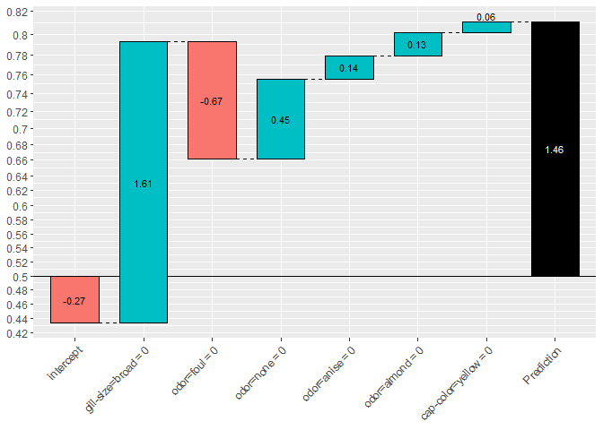

```{r setup, include=FALSE}
require(tidyverse)
require(magrittr)

knitr::opts_knit$set(
  progress = TRUE, 
  verbose = TRUE, 
  root.dir = "."
)
knitr::opts_chunk$set(
  collapse = TRUE,
  comment = "#>",
  message = FALSE
)
```


# 目的

XGBoostの予測を分解するツール`XGBoostExplainer`は、あるインスタンスについて得られたXGBoostによる予測結果が、どのように構成されているか可視化してくれる。



コンセプトとしては、randomforestにおけるforestfloorと同じく、feature contributionの考え方を、個々のインスタンスのxgboostによる予測結果の可視化のために適用している。

探索的なデータ分析に使うだけならおおむね問題ないが、論文などの詳細な資料が見つけられなかったため、具体的に何をやっているか説明しようとして困った。そこで、`XGBoostExplainer`の実装を追いかけて、何をやっているか調べた。

## 関連シリーズ

1. とりあえず使ってみる（この記事）
2. 予測結果の可視化プロセスをstep-by-stepで実行する
3. 学習したxgboostのルール抽出をstep-by-stepで実行する
4. 予測結果のbreakdownをstep-by-stepで実行する

## 参考

開発元の紹介記事

> [NEW R package that makes XGBoost   interpretable](https://medium.com/applied-data-science/new-r-package-the-xgboost-explainer-51dd7d1aa211)


# とりあえず使ってみる

すでに日本語の紹介記事がある。

> [xgboost の中を覗いてみる](https://qiita.com/vascoosx/items/efb3177ecf2ead5d8ce0)

`xgboostExplainer`のマニュアルにあるexampleからコピペを眺める。

## インストール

本家の記事に従ってgithubからインストール

```{r install.package, eval=FALSE}
install.packages("devtools") 
library(devtools) 
install_github("AppliedDataSciencePartners/xgboostExplainer")
```
## XGBモデルの学習と予測

今回は`xgboost`パッケージ付属のサンプルデータで、いつもの食えるキノコと毒キノコの2値分類。細かいチューニングは、必要に応じてautoxgbあたりでチューニングするとよいが、今回は省略。

```{r train.and.predict, message=FALSE, results="hide"}
library(xgboost)
require(tidyverse)
library(xgboost)
library(xgboostExplainer)

set.seed(123)

data(agaricus.train, package='xgboost')

X = as.matrix(agaricus.train$data)
y = agaricus.train$label
table(y)
train_idx = 1:5000

train.data = X[train_idx,]
test.data = X[-train_idx,]

xgb.train.data <- xgb.DMatrix(train.data, label = y[train_idx])
xgb.test.data <- xgb.DMatrix(test.data)

param <- list(objective = "binary:logistic")
xgb.model <- xgboost(param =param,  data = xgb.train.data, nrounds=3)
# 
# col_names = colnames(X)
# 
# pred.train = predict(xgb.model,X)
# nodes.train = predict(xgb.model,X,predleaf =TRUE)
# trees = xgb.model.dt.tree(col_names, model = xgb.model)

```

## 個別の予測結果の可視化

`xgboostExplainer`のマニュアルにあるexampleのコピペ（つづき）。高度にwrapされているためわずか3行でstep-by-stepが完了する。

### STEP.1. 学習済みXGBモデルからルールセット（leafまでのパス）を列挙してテーブル化

`base_score`オプションはxgboostのオプションそのままで、ターゲット集団のクラス不均衡を表す事前確率。すなわち正例：負例＝300:700を仮定できる対象であれば、`base_score = 0.3`となる(デフォルトは1:1を表す0.5)。

```{r}
library(xgboostExplainer)

explainer = buildExplainer(xgb.model,xgb.train.data, type="binary", base_score = 0.5, trees = NULL)

```
### STEP.2. Get multiple prediction breakdowns from a trained xgboost model

マニュアルには step2とあるのだが、実はパッケージを使うだけならスキップできてしまう。

### STEP.3. 予測対象(インスタンス)に適用される各treeのパスを集計して可視化

2値分類(`binary:logistic`)では、片側のクラスに属する確率p（左軸の数値）のロジット（対数オッズ；棒グラフ中の数値）が足し合わされている様子を表示する。

```{r, message=FALSE}
showWaterfall(xgb.model, explainer, xgb.test.data, test.data,  2, type = "binary")

```

(参考) `binary:logistic`の場合、`base_score`で設定した事前確率は ベースラインとしてinterceptに反映される。下記の例ではinterceptだけが下がっていることに注目されたい。

```{r, results="hide", message=FALSE}
explainer = buildExplainer(xgb.model,xgb.train.data, type="binary", base_score = 0.2, trees = NULL)

```
```{r, message=FALSE}
showWaterfall(xgb.model, explainer, xgb.test.data, test.data,  2, type = "binary")

```

次回は、`xgboostExplainer`により、xgboostのモデルと予測結果から**何が取り出され、どう捌かれているかだけ**を詳細に見ていく。