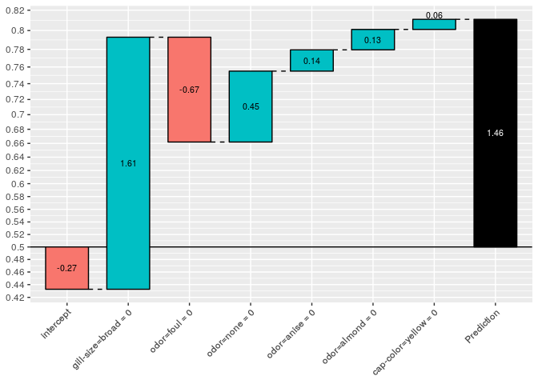

# 目的

今回は、`xgboostExplainer`によって、xgboostのモデルと予測結果から**何が取り出され、どう捌かれているか**にフォーカスして追いかける。

# 関連シリーズ

1. [とりあえず使ってみる](http://kato-kohaku-0.hatenablog.com/entry/2018/12/14/002253)
2. 予測結果の可視化プロセスをstep-by-stepで実行する（この記事）
3. 学習したxgboostのルール抽出をstep-by-stepで実行する
4. 予測結果のbreakdownをstep-by-stepで実行する


# 予測結果の可視化プロセスをstep-by-stepで眺める

`showWaterfall(..., type = "binary")`の中身を抜き書きしながら、都度、何が取り出されているか見ていく。

なお、この記事以降では、`objective = "binary:logistic"`を扱って進める。`objective = "reg:linear"`はよりシンプルな手続きであり、前者がわかれば後者は自然に理解できる。

## 準備：XGBモデルの学習と予測

`xgboostExplainer`のマニュアルにあるexampleからコピペ。


```r
require(tidyverse)
library(xgboost)
library(xgboostExplainer)

set.seed(123)

data(agaricus.train, package='xgboost')

X = as.matrix(agaricus.train$data)
y = agaricus.train$label
table(y)
train_idx = 1:5000

train.data = X[train_idx,]
test.data = X[-train_idx,]

xgb.train.data <- xgb.DMatrix(train.data, label = y[train_idx])
xgb.test.data <- xgb.DMatrix(test.data)

param <- list(objective = "binary:logistic")
xgb.model <- xgboost(param =param,  data = xgb.train.data, nrounds=3)
```

## 可視化の手続き(overview)

あるインスタンスの予測結果を可視化する手順は：

1. 学習したxgboostのモデルから予測ルールを抽出する
2. `showWaterfall()`のなかで
    1. 指定したインスタンスの予測結果を予測ルールから分解再構成する
    2. 分解再構成した予測結果をwatarfall chartで可視化する

なお、

* `buildExplainer()`が**どうやって**モデルから予測ルールを抽出しているか
* `explainPredictions()`が**どうやって**分解再構成するか

については今回は触れない。

### 学習したxgboostのモデルから予測ルールを抽出する

`buildExplainer()`が抽出した予測ルール(ノード)を眺める。


```r
library(xgboostExplainer)

explainer = buildExplainer(xgb.model,xgb.train.data, type="binary", base_score = 0.5, trees = NULL)
```

今回はルールの数が多いので、一度も登場しないものを除外してみる：


```r
nonzero.cols <- abs(explainer) %>% 
  colSums() %>% 
  is_greater_than(0.0) %>% 
  which()

explainer %>% 
  select(nonzero.cols %>% rev()) %>% 
  set_colnames(
    colnames(.) %>% 
      str_trunc(width=10, side="left"))
#>     tree leaf   intercept  ...r=green ...g=silky ...e=broad  odor=none
#>  1:    0    2 -0.11061173  0.00000000  0.0000000  0.0000000  0.0000000
#>  2:    0    7 -0.11061173 -0.02193993  0.0000000 -0.1919848  0.0000000
#>  3:    0    8 -0.11061173  1.13508088  0.0000000 -0.1919848  0.0000000
#>  4:    0   10 -0.11061173  0.00000000  0.0000000  0.6632849  0.1868594
#>  5:    0   12 -0.11061173  0.00000000  0.8995779  0.6632849 -0.6576614
#>  6:    0   14 -0.11061173  0.00000000  0.0000000  0.6632849  0.1868594
#>  7:    0   15 -0.11061173  0.00000000 -0.1528694  0.6632849 -0.6576614
#>  8:    0   16 -0.11061173  0.00000000 -0.1528694  0.6632849 -0.6576614
#>  9:    0   17 -0.11061173  0.00000000  0.0000000  0.6632849  0.1868594
#> 10:    0   18 -0.11061173  0.00000000  0.0000000  0.6632849  0.1868594
#> 11:    1    2 -0.08586974  0.00000000  0.0000000  0.0000000  0.0000000
#> 12:    1    7 -0.08586974 -0.01726586  0.0000000 -0.1483337  0.0000000
#> 13:    1    8 -0.08586974  0.88295840  0.0000000 -0.1483337  0.0000000
#> 14:    1   10 -0.08586974  0.00000000  0.0000000  0.5101908  0.1433645
#> 15:    1   12 -0.08586974  0.00000000  0.7008943  0.5101908 -0.5018480
#> 16:    1   13 -0.08586974  0.00000000  0.0000000  0.5101908  0.1433645
#> 17:    1   14 -0.08586974  0.00000000  0.0000000  0.5101908  0.1433645
#> 18:    1   15 -0.08586974  0.00000000 -0.1208858  0.5101908 -0.5018480
#> 19:    1   16 -0.08586974  0.00000000 -0.1208858  0.5101908 -0.5018480
#> 20:    2    2 -0.07436510  0.00000000  0.0000000  0.0000000  0.0000000
#> 21:    2    7 -0.07436510 -0.01523278  0.0000000 -0.1291144  0.0000000
#> 22:    2    8 -0.07436510  0.76272457  0.0000000 -0.1291144  0.0000000
#> 23:    2   10 -0.07436510  0.00000000  0.0000000  0.4407547  0.1238637
#> 24:    2   12 -0.07436510  0.00000000  0.5980809  0.4407547 -0.4287505
#> 25:    2   13 -0.07436510  0.00000000  0.0000000  0.4407547  0.1238637
#> 26:    2   14 -0.07436510  0.00000000  0.0000000  0.4407547  0.1238637
#> 27:    2   15 -0.07436510  0.00000000 -0.1059506  0.4407547 -0.4287505
#> 28:    2   16 -0.07436510  0.00000000 -0.1059506  0.4407547 -0.4287505
#>     tree leaf   intercept  ...r=green ...g=silky ...e=broad  odor=none
#>      odor=foul  odor=anise  ...=almond  ...bruises  ...=yellow
#>  1:  0.7088975  0.00000000  0.00000000  0.00000000  0.00000000
#>  2: -0.2745896  0.00000000  0.00000000  0.00000000  0.00000000
#>  3: -0.2745896  0.00000000  0.00000000  0.00000000  0.00000000
#>  4: -0.2745896  0.00000000  0.00000000  0.00000000 -1.00780012
#>  5: -0.2745896  0.00000000  0.00000000  0.00000000  0.00000000
#>  6: -0.2745896  0.00000000 -1.02528500  0.00000000  0.06468987
#>  7: -0.2745896  0.00000000  0.00000000 -0.05144537  0.00000000
#>  8: -0.2745896  0.00000000  0.00000000  0.93244731  0.00000000
#>  9: -0.2745896  0.03208427  0.03399723  0.00000000  0.06468987
#> 10: -0.2745896 -1.04934438  0.03399723  0.00000000  0.06468987
#> 11:  0.5493453  0.00000000  0.00000000  0.00000000  0.00000000
#> 12: -0.2125787  0.00000000  0.00000000  0.00000000  0.00000000
#> 13: -0.2125787  0.00000000  0.00000000  0.00000000  0.00000000
#> 14: -0.2125787  0.00000000 -0.78526446  0.00000000  0.00000000
#> 15: -0.2125787  0.00000000  0.00000000  0.00000000  0.00000000
#> 16: -0.2125787  0.05522851  0.05139002  0.00000000  0.00000000
#> 17: -0.2125787 -0.83485874  0.05139002  0.00000000  0.00000000
#> 18: -0.2125787  0.00000000  0.00000000 -0.04271214  0.00000000
#> 19: -0.2125787  0.00000000  0.00000000  0.74060173  0.00000000
#> 20:  0.4766099  0.00000000  0.00000000  0.00000000  0.00000000
#> 21: -0.1841252  0.00000000  0.00000000  0.00000000  0.00000000
#> 22: -0.1841252  0.00000000  0.00000000  0.00000000  0.00000000
#> 23: -0.1841252  0.00000000 -0.67413428  0.00000000  0.00000000
#> 24: -0.1841252  0.00000000  0.00000000  0.00000000  0.00000000
#> 25: -0.1841252  0.04896816  0.04534281  0.00000000  0.00000000
#> 26: -0.1841252 -0.71778146  0.04534281  0.00000000  0.00000000
#> 27: -0.1841252  0.00000000  0.00000000 -0.03984976  0.00000000
#> 28: -0.1841252  0.00000000  0.00000000  0.63572177  0.00000000
#>      odor=foul  odor=anise  ...=almond  ...bruises  ...=yellow
```

`nrounds = 3`に対応する`tree`が３、それぞれの木のleafにたどり着くためのルールの組み合わせと、更新される予測の量がわかる。


### 指定したインスタンスの予測結果を予測ルールから分解再構成する


指定したインスタンスの予測結果を、`buildExplainer()`が再構成した結果(rules breakdown)を眺める。


```r
# showWaterfall(xgb.model, explainer, xgb.test.data, test.data,  2, type = "binary")

DMatrix = xgb.test.data
data.matrix = test.data
idx = 2
type = "binary"
threshold = 1e-04
limits = c(NA, NA)

breakdown = explainPredictions(xgb.model, explainer, slice(DMatrix, as.integer(idx)))
```

ルールが多いので非ゼロのものだけ眺める。

```r
breakdown_summary = as.matrix(breakdown)[1, ]
breakdown_summary[which(abs(breakdown_summary) > 0.0)]
#> cap-color=yellow      odor=almond       odor=anise        odor=foul 
#>       0.06468987       0.13073006       0.13628094      -0.67129347 
#>        odor=none  gill-size=broad        intercept 
#>       0.45408751       1.61423045      -0.27084657
```


今回は、`objective = "binary:logistic"`なので、予測値(対数オッズ)は逆ロジット変換により予測結果(クラス所属確率)に変換される

```r
(weight = rowSums(breakdown))
#> [1] 1.457879

(pred = 1/(1 + exp(-weight)))
#> [1] 0.811208
```

### 分解再構成した予測結果を可視化する

プロットの方針は以下の通り。

1. ベースライン(Intercept)を先頭に表示、残りをインパクト(貢献量)が大きい順に表示
2. インパクトが微小(`< threshold`)のルールは、その他(`other_impact`)にまとめる


```r
data_for_label = data.matrix[idx, ]
i = order(abs(breakdown_summary), decreasing = TRUE)
breakdown_summary = breakdown_summary[i]
data_for_label = data_for_label[i]

intercept = breakdown_summary[names(breakdown_summary) == "intercept"]
data_for_label = data_for_label[names(breakdown_summary) != "intercept"]
breakdown_summary = breakdown_summary[names(breakdown_summary) != "intercept"]
```


`threshold`の値はオプション指定で変更でき、インパクトの大きなルールだけに絞り込んで表示できる。やたら細かいルールがいっぱい生えちゃったとかでもない限り((tree depthのチューニングに失敗してoverfitしてそうではあるし、一つのインスタンスの説明用途としては失敗しているともいえる。))`threshold`はデフォルトのままで良さそう。


```r
i_other = which(abs(breakdown_summary) < threshold)
other_impact = 0
if (length(i_other > 0)) {
  other_impact = sum(breakdown_summary[i_other])
  names(other_impact) = "other"
  breakdown_summary = breakdown_summary[-i_other]
  data_for_label = data_for_label[-i_other]
}
if (abs(other_impact) > 0) {
  breakdown_summary = c(intercept, breakdown_summary, other_impact)
  data_for_label = c("", data_for_label, "")
  labels = paste0(names(breakdown_summary), " = ", data_for_label)
  labels[1] = "intercept"
  labels[length(labels)] = "other"
} else {
  breakdown_summary = c(intercept, breakdown_summary)
  data_for_label = c("", data_for_label)
  labels = paste0(names(breakdown_summary), " = ", data_for_label)
  labels[1] = "intercept"
}

breakdown_summary
```

頑張って並び替えた。

### watarfall chartによる予測結果の描画

算出した値の出力。`getinfo`の箇所はラベルの実名か何かを取ろうとしてる？　キノコのデータだとスキップされる。


```r

if (!is.null(getinfo(DMatrix, "label"))) {
  cat("\nActual: ", getinfo(slice(DMatrix, as.integer(idx)), "label"))
}
cat("\nPrediction: ", pred)
#> 
#> Prediction:  0.811208
cat("\nWeight: ", weight)
#> 
#> Weight:  1.457879
cat("\nBreakdown")
#> 
#> Breakdown
cat("\n")
print(breakdown_summary)
#>        intercept  gill-size=broad        odor=foul        odor=none 
#>      -0.27084657       1.61423045      -0.67129347       0.45408751 
#>       odor=anise      odor=almond cap-color=yellow 
#>       0.13628094       0.13073006       0.06468987
```


予測結果(クラス所属確率)で表示するための工夫をする。`inverse_logit_labels`と`logit`は、y軸を対数オッズからクラス所属確率に読み替えるための関数。

((inverse_logit_trans`はコメントアウトしても動作する。レガシーだろうか？))


```r
inverse_logit_trans <- scales::trans_new("inverse logit", transform = plogis, inverse = qlogis)

inverse_logit_labels = function(x) {
  return(1/(1 + exp(-x)))
}

logit = function(x) {
  return(log(x/(1 - x)))
}

ybreaks <- logit(seq(2, 98, 2)/100)

waterfalls::waterfall(
  values = breakdown_summary,
  rect_text_labels = round(breakdown_summary, 2),
  labels = labels, 
  total_rect_text = round(weight, 2),
  calc_total = TRUE,
  total_axis_text = "Prediction") + 
  scale_y_continuous(labels = inverse_logit_labels,
                     breaks = ybreaks, 
                     limits = limits) + 
  theme(axis.text.x = element_text(angle = 45, hjust = 1))
```

<!-- -->

`waterfalls::waterfall()`は、外部のパッケージをそのまま利用する。[開発元](https://jameshoward.us/software/waterfall/)を参照されたい。

次回は、`buildExplainer()`が、どのような手続きで指定したインスタンスの予測結果を分解再構成しているのか詳細に見ていく。
