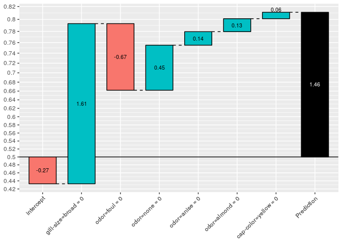

# 目的

今回は、`xgboostExplainer`によって、xgboostの学習済みモデルから**ルールがどうやって抽出されているか**にフォーカスして追いかける。

# 関連シリーズ

1. とりあえず使ってみる
2. 予測結果の可視化プロセスをstep-by-stepで実行する
3. 学習したxgboostのルール抽出をstep-by-stepで実行する（この記事）
4. 予測結果のbreakdownをstep-by-stepで実行する


# 準備：XGBモデルの学習と予測

`xgboostExplainer`のマニュアルにあるexampleからコピペ。


```r
require(tidyverse)
library(xgboost)
library(xgboostExplainer)

set.seed(123)

data(agaricus.train, package='xgboost')

X = as.matrix(agaricus.train$data)
y = agaricus.train$label
table(y)
train_idx = 1:5000

train.data = X[train_idx,]
test.data = X[-train_idx,]

xgb.train.data <- xgb.DMatrix(train.data, label = y[train_idx])
xgb.test.data <- xgb.DMatrix(test.data)

param <- list(objective = "binary:logistic")
xgb.model <- xgboost(param =param,  data = xgb.train.data, nrounds=3)
```


# 学習したxgboostのルール抽出


`buildExplainer()`の中身を抜き書きしながら、step-by-stepで眺める


```r
# explainer = buildExplainer(xgb.model,xgb.train.data, type="binary", base_score = 0.5, trees = NULL)
# function (xgb.model, trainingData, type = "binary", base_score = 0.5, trees_idx = NULL) 
# {
trainingData = xgb.train.data
type = "binary" 
base_score = 0.5
trees_idx = NULL
```

## モデルからパスを抽出

[`xgboost::xgb.model.dt.tree()`](https://www.imsbio.co.jp/RGM/R_rdfile?f=xgboost/man/xgb.model.dt.tree.Rd&d=R_CC)を使う。


```r
col_names = attr(trainingData, ".Dimnames")[[2]]
col_names %>% head()
#> [1] "cap-shape=bell"    "cap-shape=conical" "cap-shape=convex" 
#> [4] "cap-shape=flat"    "cap-shape=knobbed" "cap-shape=sunken"

cat("\nCreating the trees of the xgboost model...")
#> 
#> Creating the trees of the xgboost model...
trees = xgb.model.dt.tree(col_names, model = xgb.model, trees = trees_idx)

trees %>% 
  mutate(Feature = str_trunc(Feature, width=12, side="left")) %>% 
  select(-Missing)
#>    Tree Node   ID      Feature Split  Yes   No      Quality       Cover
#> 1     0    0  0-0    odor=foul   0.5  0-1  0-2 2711.3557100 1250.000000
#> 2     0    1  0-1 ...ize=broad   0.5  0-3  0-4 1263.3979500  901.000000
#> 3     0    2  0-2         Leaf    NA <NA> <NA>    0.5982857  349.000000
#> 4     0    3  0-3    odor=none   0.5  0-5  0-6  264.4693910  202.250000
#> 5     0    4  0-4 ...lor=green   0.5  0-7  0-8  203.9635310  698.750000
#> 6     0    5  0-5 ...or=yellow   0.5  0-9 0-10  121.6305770  157.500000
#> 7     0    6  0-6 ...ing=silky   0.5 0-11 0-12   74.7532349   44.750000
#> 8     0    7  0-7         Leaf    NA <NA> <NA>   -0.5991260  685.500000
#> 9     0    8  0-8         Leaf    NA <NA> <NA>    0.5578948   13.250000
#> 10    0    9  0-9  odor=almond   0.5 0-13 0-14   65.5069656  148.000000
#> 11    0   10 0-10         Leaf    NA <NA> <NA>   -0.5428572    9.500000
#> 12    0   11 0-11 ...?=bruises   0.5 0-15 0-16   26.8929482   38.250000
#> 13    0   12 0-12         Leaf    NA <NA> <NA>    0.5200000    6.500000
#> 14    0   13 0-13   odor=anise   0.5 0-17 0-18   62.2878838  143.250000
#> 15    0   14 0-14         Leaf    NA <NA> <NA>   -0.4956522    4.750000
#> 16    0   15 0-15         Leaf    NA <NA> <NA>   -0.5838926   36.250000
#> 17    0   16 0-16         Leaf    NA <NA> <NA>    0.4000000    2.000000
#> 18    0   17 0-17         Leaf    NA <NA> <NA>    0.5957143  139.000000
#> 19    0   18 0-18         Leaf    NA <NA> <NA>   -0.4857143    4.250000
#> 20    1    0  1-0    odor=foul   0.5  1-1  1-2 1489.0952100 1145.302000
#> 21    1    1  1-1 ...ize=broad   0.5  1-3  1-4  691.4842530  825.759888
#> 22    1    2  1-2         Leaf    NA <NA> <NA>    0.4634756  319.542114
#> 23    1    3  1-3    odor=none   0.5  1-5  1-6  142.5185550  186.003708
#> 24    1    4  1-4 ...lor=green   0.5  1-7  1-8  114.8126300  639.756165
#> 25    1    5  1-5  odor=almond   0.5  1-9 1-10   69.8917542  144.674194
#> 26    1    6  1-6 ...ing=silky   0.5 1-11 1-12   42.7613907   41.329517
#> 27    1    7  1-7         Leaf    NA <NA> <NA>   -0.4640480  627.485962
#> 28    1    8  1-8         Leaf    NA <NA> <NA>    0.4361763   12.270212
#> 29    1    9  1-9   odor=anise   0.5 1-13 1-14   75.4965286  135.787827
#> 30    1   10 1-10         Leaf    NA <NA> <NA>   -0.4301576    8.886355
#> 31    1   11 1-11 ...?=bruises   0.5 1-15 1-16   16.6019783   35.249847
#> 32    1   12 1-12         Leaf    NA <NA> <NA>    0.4107886    6.079669
#> 33    1   13 1-13         Leaf    NA <NA> <NA>    0.4617254  127.362411
#> 34    1   14 1-14         Leaf    NA <NA> <NA>   -0.4283619    8.425421
#> 35    1   15 1-15         Leaf    NA <NA> <NA>   -0.4537036   33.327763
#> 36    1   16 1-16         Leaf    NA <NA> <NA>    0.3296103    1.922086
#> 37    2    0  2-0    odor=foul   0.5  2-1  2-2  934.9316410  956.514771
#> 38    2    1  2-1 ...ize=broad   0.5  2-3  2-4  434.1681820  689.965515
#> 39    2    2  2-2         Leaf    NA <NA> <NA>    0.4022448  266.549286
#> 40    2    3  2-3    odor=none   0.5  2-5  2-6   87.7709885  156.324432
#> 41    2    4  2-4 ...lor=green   0.5  2-7  2-8   73.6840591  533.641052
#> 42    2    5  2-5  odor=almond   0.5  2-9 2-10   44.8767204  121.285667
#> 43    2    6  2-6 ...ing=silky   0.5 2-11 2-12   27.4686470   35.038773
#> 44    2    7  2-7         Leaf    NA <NA> <NA>   -0.4028375  523.192078
#> 45    2    8  2-8         Leaf    NA <NA> <NA>    0.3751199   10.448951
#> 46    2    9  2-9   odor=anise   0.5 2-13 2-14   48.7504120  113.642014
#> 47    2   10 2-10         Leaf    NA <NA> <NA>   -0.3680061    7.643652
#> 48    2   11 2-11 ...?=bruises   0.5 2-15 2-16   11.4850969   29.765743
#> 49    2   12 2-12         Leaf    NA <NA> <NA>    0.3515948    5.273030
#> 50    2   13 2-13         Leaf    NA <NA> <NA>    0.4004391  106.384308
#> 51    2   14 2-14         Leaf    NA <NA> <NA>   -0.3663105    7.257702
#> 52    2   15 2-15         Leaf    NA <NA> <NA>   -0.3922864   28.009958
#> 53    2   16 2-16         Leaf    NA <NA> <NA>    0.2832851    1.755784
# %>%
#   mutate_at(.vars = vars("Quality","Cover"), .funs = round)
```

「LeafノードのQualityは0じゃないの？」と思うかもしれないが、マニュアルに

> Quality: either the split gain (change in loss) **or the leaf value**

と書いてあり、LeafノードではQualityのセルが**予測結果の格納場所として流用されている**ことに注意。（あとからこれを利用する）((論文を読んでからコードを読み進めていて、ここではまった。))

[`predict(..., predleaf = TRUE)`](https://www.rdocumentation.org/packages/xgboost/versions/0.71.2/topics/predict.xgb.Booster)を指定することで、予測値の代わりに訓練データのインスタンスが各treeで所属するLeafのノード番号を取得できる。
今回は`NROW(trainingData)=5000, nrounds = 3`なので、5000行3列の所属Leafの行列が得られる。


```r
cat("\nGetting the leaf nodes for the training set observations...")
#> 
#> Getting the leaf nodes for the training set observations...
nodes.train = predict(xgb.model, trainingData, predleaf = TRUE)

nodes.train %>% dim()
#> [1] 5000    3
nodes.train <- NULL
```

ただし、取得されたのち、学習に使われたインスタンスの予測結果の情報が、`buildExplainer()`のどこかで使われている形跡は見当たらなかった((この実装、全般的にレガシーが残っている傾向があって、追いかけていったら途中で行き止まりだった、みたいなことが、あちこちである))。

## 各roundの予測ルールを抽出・整理する

以下では、`buildExplainer()`のエンジン部分である`xgboostExplainer:::getStatsForTrees()`の一連のステップをトレースする。

```r

# tree_list = xgboostExplainer:::getStatsForTrees(trees, nodes.train, type = type, base_score = base_score)
# function (trees, nodes.train, type = "binary", base_score = 0.5) 
# {

```

なお、関数内部で`data.table::copy()'による`- attr(*, ".internal.selfref")=<externalptr>`によって、**データの更新が参照渡しとして行われている**のに注意。これがまたトレーサビリティを下げている。

### Cover(H)の再計算

`xgb.model.dt.tree()`の情報を根拠に予測値を算出するためのパスと予測値の更新量を取り出す。`xgb.model.dt.tree()`のCoverは精度に難がある((途中の丸め方に問題があるのかな))とのことで、予測結果の分解に必要になるので、きちんととした精度で計算しなおす。


```r
type = "binary"
base_score = 0.5

tree_datatable = data.table::copy(trees)

tree_datatable[, leaf := (Feature == "Leaf")]
non.leaves = which(tree_datatable[, leaf] == F)

tree_datatable[, H := Cover]

cat("\n\nRecalculating the cover for each non-leaf... \n")
#> 
#> 
#> Recalculating the cover for each non-leaf...
print.counter = 1
for (i in rev(non.leaves)) {
  left = tree_datatable[i, Yes]
  right = tree_datatable[i, No]
  
  tree_datatable[i, H := (tree_datatable[ID == left, H] + 
                            tree_datatable[ID == right, H])]
  
  if(print.counter < 5){
    print(i - 1)
    
    bind_rows(tree_datatable[i, ],
              tree_datatable[ID == left, ], 
              tree_datatable[ID == right,]) %>% 
      select(-Tree,-Node,-Feature,-Split,-Missing) %>% 
      print()
    print.counter <- print.counter + 1
  }

}
#> [1] 47
#>      ID  Yes   No    Quality     Cover  leaf         H
#> 1: 2-11 2-15 2-16 11.4850969 29.765743 FALSE 29.765742
#> 2: 2-15 <NA> <NA> -0.3922864 28.009958  TRUE 28.009958
#> 3: 2-16 <NA> <NA>  0.2832851  1.755784  TRUE  1.755784
#> [1] 45
#>      ID  Yes   No    Quality      Cover  leaf          H
#> 1:  2-9 2-13 2-14 48.7504120 113.642014 FALSE 113.642010
#> 2: 2-13 <NA> <NA>  0.4004391 106.384308  TRUE 106.384308
#> 3: 2-14 <NA> <NA> -0.3663105   7.257702  TRUE   7.257702
#> [1] 42
#>      ID  Yes   No    Quality    Cover  leaf        H
#> 1:  2-6 2-11 2-12 27.4686470 35.03877 FALSE 35.03877
#> 2: 2-11 2-15 2-16 11.4850969 29.76574 FALSE 29.76574
#> 3: 2-12 <NA> <NA>  0.3515948  5.27303  TRUE  5.27303
#> [1] 41
#>      ID  Yes   No    Quality      Cover  leaf          H
#> 1:  2-5  2-9 2-10 44.8767204 121.285667 FALSE 121.285663
#> 2:  2-9 2-13 2-14 48.7504120 113.642014 FALSE 113.642010
#> 3: 2-10 <NA> <NA> -0.3680061   7.643652  TRUE   7.643652
```

```r
base_weight = log(base_score/(1 - base_score))

tree_datatable[,previous_weight:=base_weight]
tree_datatable[1,previous_weight:=0]

tree_datatable[leaf==T,weight:=base_weight + Quality]


tree_datatable[leaf==T,G:=-weight*H]
tree_datatable %>% 
  select(-Tree,-Node,-Feature,-Split,-Missing) %>% 
  knitr::kable()
```


ID     Yes    No           Quality         Cover  leaf               H   previous_weight       weight              G
-----  -----  -----  -------------  ------------  ------  ------------  ----------------  -----------  -------------
0-0    0-1    0-2     2711.3557100   1250.000000  FALSE    1250.000000                 0           NA             NA
0-1    0-3    0-4     1263.3979500    901.000000  FALSE     901.000000                 0           NA             NA
0-2    NA     NA         0.5982857    349.000000  TRUE      349.000000                 0    0.5982857   -208.8017215
0-3    0-5    0-6      264.4693910    202.250000  FALSE     202.250000                 0           NA             NA
0-4    0-7    0-8      203.9635310    698.750000  FALSE     698.750000                 0           NA             NA
0-5    0-9    0-10     121.6305770    157.500000  FALSE     157.500000                 0           NA             NA
0-6    0-11   0-12      74.7532349     44.750000  FALSE      44.750000                 0           NA             NA
0-7    NA     NA        -0.5991260    685.500000  TRUE      685.500000                 0   -0.5991260    410.7009011
0-8    NA     NA         0.5578948     13.250000  TRUE       13.250000                 0    0.5578948     -7.3921056
0-9    0-13   0-14      65.5069656    148.000000  FALSE     148.000000                 0           NA             NA
0-10   NA     NA        -0.5428572      9.500000  TRUE        9.500000                 0   -0.5428572      5.1571431
0-11   0-15   0-16      26.8929482     38.250000  FALSE      38.250000                 0           NA             NA
0-12   NA     NA         0.5200000      6.500000  TRUE        6.500000                 0    0.5200000     -3.3800003
0-13   0-17   0-18      62.2878838    143.250000  FALSE     143.250000                 0           NA             NA
0-14   NA     NA        -0.4956522      4.750000  TRUE        4.750000                 0   -0.4956522      2.3543478
0-15   NA     NA        -0.5838926     36.250000  TRUE       36.250000                 0   -0.5838926     21.1661083
0-16   NA     NA         0.4000000      2.000000  TRUE        2.000000                 0    0.4000000     -0.8000001
0-17   NA     NA         0.5957143    139.000000  TRUE      139.000000                 0    0.5957143    -82.8042920
0-18   NA     NA        -0.4857143      4.250000  TRUE        4.250000                 0   -0.4857143      2.0642858
1-0    1-1    1-2     1489.0952100   1145.302000  FALSE    1145.301993                 0           NA             NA
1-1    1-3    1-4      691.4842530    825.759888  FALSE     825.759879                 0           NA             NA
1-2    NA     NA         0.4634756    319.542114  TRUE      319.542114                 0    0.4634756   -148.0999586
1-3    1-5    1-6      142.5185550    186.003708  FALSE     186.003705                 0           NA             NA
1-4    1-7    1-8      114.8126300    639.756165  FALSE     639.756174                 0           NA             NA
1-5    1-9    1-10      69.8917542    144.674194  FALSE     144.674187                 0           NA             NA
1-6    1-11   1-12      42.7613907     41.329517  FALSE      41.329518                 0           NA             NA
1-7    NA     NA        -0.4640480    627.485962  TRUE      627.485962                 0   -0.4640480    291.1835856
1-8    NA     NA         0.4361763     12.270212  TRUE       12.270212                 0    0.4361763     -5.3519758
1-9    1-13   1-14      75.4965286    135.787827  FALSE     135.787832                 0           NA             NA
1-10   NA     NA        -0.4301576      8.886355  TRUE        8.886355                 0   -0.4301576      3.8225336
1-11   1-15   1-16      16.6019783     35.249847  FALSE      35.249849                 0           NA             NA
1-12   NA     NA         0.4107886      6.079669  TRUE        6.079669                 0    0.4107886     -2.4974591
1-13   NA     NA         0.4617254    127.362411  TRUE      127.362411                 0    0.4617254    -58.8064543
1-14   NA     NA        -0.4283619      8.425421  TRUE        8.425421                 0   -0.4283619      3.6091292
1-15   NA     NA        -0.4537036     33.327763  TRUE       33.327763                 0   -0.4537036     15.1209243
1-16   NA     NA         0.3296103      1.922086  TRUE        1.922086                 0    0.3296103     -0.6335394
2-0    2-1    2-2      934.9316410    956.514771  FALSE     956.514750                 0           NA             NA
2-1    2-3    2-4      434.1681820    689.965515  FALSE     689.965464                 0           NA             NA
2-2    NA     NA         0.4022448    266.549286  TRUE      266.549286                 0    0.4022448   -107.2180578
2-3    2-5    2-6       87.7709885    156.324432  FALSE     156.324435                 0           NA             NA
2-4    2-7    2-8       73.6840591    533.641052  FALSE     533.641029                 0           NA             NA
2-5    2-9    2-10      44.8767204    121.285667  FALSE     121.285663                 0           NA             NA
2-6    2-11   2-12      27.4686470     35.038773  FALSE      35.038772                 0           NA             NA
2-7    NA     NA        -0.4028375    523.192078  TRUE      523.192078                 0   -0.4028375    210.7613652
2-8    NA     NA         0.3751199     10.448951  TRUE       10.448951                 0    0.3751199     -3.9196093
2-9    2-13   2-14      48.7504120    113.642014  FALSE     113.642010                 0           NA             NA
2-10   NA     NA        -0.3680061      7.643652  TRUE        7.643652                 0   -0.3680061      2.8129110
2-11   2-15   2-16      11.4850969     29.765743  FALSE      29.765742                 0           NA             NA
2-12   NA     NA         0.3515948      5.273030  TRUE        5.273030                 0    0.3515948     -1.8539700
2-13   NA     NA         0.4004391    106.384308  TRUE      106.384308                 0    0.4004391    -42.6004379
2-14   NA     NA        -0.3663105      7.257702  TRUE        7.257702                 0   -0.3663105      2.6585726
2-15   NA     NA        -0.3922864     28.009958  TRUE       28.009958                 0   -0.3922864     10.9879254
2-16   NA     NA         0.2832851      1.755784  TRUE        1.755784                 0    0.2832851     -0.4973875


```r
tree_list = split(tree_datatable,as.factor(tree_datatable$Tree))
tree_list %>% str(1)
#> List of 3
#>  $ 0:Classes 'data.table' and 'data.frame':	19 obs. of  15 variables:
#>   ..- attr(*, ".internal.selfref")=<externalptr> 
#>  $ 1:Classes 'data.table' and 'data.frame':	17 obs. of  15 variables:
#>   ..- attr(*, ".internal.selfref")=<externalptr> 
#>  $ 2:Classes 'data.table' and 'data.frame':	17 obs. of  15 variables:
#>   ..- attr(*, ".internal.selfref")=<externalptr>
```


```r
num_tree_list = length(tree_list)
treenums =  as.character(0:(num_tree_list-1))
t = 0
cat('\n\nFinding the stats for the xgboost trees...\n')
#> 
#> 
#> Finding the stats for the xgboost trees...
# pb <- txtProgressBar(style=3)
for (tree in tree_list){
  t=t+1
  num_nodes = nrow(tree)
  non_leaf_rows = rev(which(tree[,leaf]==F))
  for (r in non_leaf_rows){
    left = tree[r,Yes]
    right = tree[r,No]
    leftG = tree[ID==left,G]
    rightG = tree[ID==right,G]
    
    tree[r,G:=leftG+rightG]
    w=tree[r,-G/H]
    
    tree[r,weight:=w]
    tree[ID==left,previous_weight:=w]
    tree[ID==right,previous_weight:=w]
    
    bind_rows(tree[r,], tree[ID==left,], tree[ID==right,]) %>% print()
  }
  
  tree[,uplift_weight:=weight-previous_weight]
  # setTxtProgressBar(pb, t / num_tree_list)
}
#>    Tree Node   ID    Feature Split  Yes   No Missing    Quality  Cover
#> 1:    0   13 0-13 odor=anise   0.5 0-17 0-18    0-17 62.2878838 143.25
#> 2:    0   17 0-17       Leaf    NA <NA> <NA>    <NA>  0.5957143 139.00
#> 3:    0   18 0-18       Leaf    NA <NA> <NA>    <NA> -0.4857143   4.25
#>     leaf      H previous_weight     weight          G
#> 1: FALSE 143.25       0.0000000  0.5636301 -80.740006
#> 2:  TRUE 139.00       0.5636301  0.5957143 -82.804292
#> 3:  TRUE   4.25       0.5636301 -0.4857143   2.064286
#>    Tree Node   ID          Feature Split  Yes   No Missing    Quality
#> 1:    0   11 0-11 bruises?=bruises   0.5 0-15 0-16    0-15 26.8929482
#> 2:    0   15 0-15             Leaf    NA <NA> <NA>    <NA> -0.5838926
#> 3:    0   16 0-16             Leaf    NA <NA> <NA>    <NA>  0.4000000
#>    Cover  leaf     H previous_weight     weight          G
#> 1: 38.25 FALSE 38.25       0.0000000 -0.5324473 20.3661082
#> 2: 36.25  TRUE 36.25      -0.5324473 -0.5838926 21.1661083
#> 3:  2.00  TRUE  2.00      -0.5324473  0.4000000 -0.8000001
#>    Tree Node   ID     Feature Split  Yes   No Missing    Quality  Cover
#> 1:    0    9  0-9 odor=almond   0.5 0-13 0-14    0-13 65.5069656 148.00
#> 2:    0   13 0-13  odor=anise   0.5 0-17 0-18    0-17 62.2878838 143.25
#> 3:    0   14 0-14        Leaf    NA <NA> <NA>    <NA> -0.4956522   4.75
#>     leaf      H previous_weight     weight          G
#> 1: FALSE 148.00       0.0000000  0.5296328 -78.385658
#> 2: FALSE 143.25       0.5296328  0.5636301 -80.740006
#> 3:  TRUE   4.75       0.5296328 -0.4956522   2.354348
#>    Tree Node   ID                        Feature Split  Yes   No Missing
#> 1:    0    6  0-6 stalk-surface-above-ring=silky   0.5 0-11 0-12    0-11
#> 2:    0   11 0-11               bruises?=bruises   0.5 0-15 0-16    0-15
#> 3:    0   12 0-12                           Leaf    NA <NA> <NA>    <NA>
#>     Quality Cover  leaf     H previous_weight     weight        G
#> 1: 74.75323 44.75 FALSE 44.75       0.0000000 -0.3795778 16.98611
#> 2: 26.89295 38.25 FALSE 38.25      -0.3795778 -0.5324473 20.36611
#> 3:  0.52000  6.50  TRUE  6.50      -0.3795778  0.5200000 -3.38000
#>    Tree Node   ID          Feature Split  Yes   No Missing     Quality
#> 1:    0    5  0-5 cap-color=yellow   0.5  0-9 0-10     0-9 121.6305770
#> 2:    0    9  0-9      odor=almond   0.5 0-13 0-14    0-13  65.5069656
#> 3:    0   10 0-10             Leaf    NA <NA> <NA>    <NA>  -0.5428572
#>    Cover  leaf     H previous_weight     weight          G
#> 1: 157.5 FALSE 157.5        0.000000  0.4649430 -73.228515
#> 2: 148.0 FALSE 148.0        0.464943  0.5296328 -78.385658
#> 3:   9.5  TRUE   9.5        0.464943 -0.5428572   5.157143
#>    Tree Node  ID                 Feature Split  Yes   No Missing
#> 1:    0    4 0-4 spore-print-color=green   0.5  0-7  0-8     0-7
#> 2:    0    7 0-7                    Leaf    NA <NA> <NA>    <NA>
#> 3:    0    8 0-8                    Leaf    NA <NA> <NA>    <NA>
#>        Quality  Cover  leaf      H previous_weight     weight          G
#> 1: 203.9635310 698.75 FALSE 698.75       0.0000000 -0.5771861 403.308795
#> 2:  -0.5991260 685.50  TRUE 685.50      -0.5771861 -0.5991260 410.700901
#> 3:   0.5578948  13.25  TRUE  13.25      -0.5771861  0.5578948  -7.392106
#>    Tree Node  ID                        Feature Split  Yes   No Missing
#> 1:    0    3 0-3                      odor=none   0.5  0-5  0-6     0-5
#> 2:    0    5 0-5               cap-color=yellow   0.5  0-9 0-10     0-9
#> 3:    0    6 0-6 stalk-surface-above-ring=silky   0.5 0-11 0-12    0-11
#>      Quality  Cover  leaf      H previous_weight     weight         G
#> 1: 264.46939 202.25 FALSE 202.25       0.0000000  0.2780836 -56.24241
#> 2: 121.63058 157.50 FALSE 157.50       0.2780836  0.4649430 -73.22852
#> 3:  74.75323  44.75 FALSE  44.75       0.2780836 -0.3795778  16.98611
#>    Tree Node  ID                 Feature Split Yes  No Missing   Quality
#> 1:    0    1 0-1         gill-size=broad   0.5 0-3 0-4     0-3 1263.3980
#> 2:    0    3 0-3               odor=none   0.5 0-5 0-6     0-5  264.4694
#> 3:    0    4 0-4 spore-print-color=green   0.5 0-7 0-8     0-7  203.9635
#>     Cover  leaf      H previous_weight     weight         G
#> 1: 901.00 FALSE 901.00       0.0000000 -0.3852013 347.06639
#> 2: 202.25 FALSE 202.25      -0.3852013  0.2780836 -56.24241
#> 3: 698.75 FALSE 698.75      -0.3852013 -0.5771861 403.30880
#>    Tree Node  ID         Feature Split  Yes   No Missing      Quality
#> 1:    0    0 0-0       odor=foul   0.5  0-1  0-2     0-1 2711.3557100
#> 2:    0    1 0-1 gill-size=broad   0.5  0-3  0-4     0-3 1263.3979500
#> 3:    0    2 0-2            Leaf    NA <NA> <NA>    <NA>    0.5982857
#>    Cover  leaf    H previous_weight     weight         G
#> 1:  1250 FALSE 1250       0.0000000 -0.1106117  138.2647
#> 2:   901 FALSE  901      -0.1106117 -0.3852013  347.0664
#> 3:   349  TRUE  349      -0.1106117  0.5982857 -208.8017
#>    Tree Node   ID          Feature Split  Yes   No Missing    Quality
#> 1:    1   11 1-11 bruises?=bruises   0.5 1-15 1-16    1-15 16.6019783
#> 2:    1   15 1-15             Leaf    NA <NA> <NA>    <NA> -0.4537036
#> 3:    1   16 1-16             Leaf    NA <NA> <NA>    <NA>  0.3296103
#>        Cover  leaf         H previous_weight     weight          G
#> 1: 35.249847 FALSE 35.249849       0.0000000 -0.4109914 14.4873849
#> 2: 33.327763  TRUE 33.327763      -0.4109914 -0.4537036 15.1209243
#> 3:  1.922086  TRUE  1.922086      -0.4109914  0.3296103 -0.6335394
#>    Tree Node   ID    Feature Split  Yes   No Missing    Quality      Cover
#> 1:    1    9  1-9 odor=anise   0.5 1-13 1-14    1-13 75.4965286 135.787827
#> 2:    1   13 1-13       Leaf    NA <NA> <NA>    <NA>  0.4617254 127.362411
#> 3:    1   14 1-14       Leaf    NA <NA> <NA>    <NA> -0.4283619   8.425421
#>     leaf          H previous_weight     weight          G
#> 1: FALSE 135.787832       0.0000000  0.4064968 -55.197325
#> 2:  TRUE 127.362411       0.4064968  0.4617254 -58.806454
#> 3:  TRUE   8.425421       0.4064968 -0.4283619   3.609129
#>    Tree Node   ID                        Feature Split  Yes   No Missing
#> 1:    1    6  1-6 stalk-surface-above-ring=silky   0.5 1-11 1-12    1-11
#> 2:    1   11 1-11               bruises?=bruises   0.5 1-15 1-16    1-15
#> 3:    1   12 1-12                           Leaf    NA <NA> <NA>    <NA>
#>       Quality     Cover  leaf         H previous_weight     weight
#> 1: 42.7613907 41.329517 FALSE 41.329518       0.0000000 -0.2901056
#> 2: 16.6019783 35.249847 FALSE 35.249849      -0.2901056 -0.4109914
#> 3:  0.4107886  6.079669  TRUE  6.079669      -0.2901056  0.4107886
#>            G
#> 1: 11.989926
#> 2: 14.487385
#> 3: -2.497459
#>    Tree Node   ID     Feature Split  Yes   No Missing    Quality
#> 1:    1    5  1-5 odor=almond   0.5  1-9 1-10     1-9 69.8917542
#> 2:    1    9  1-9  odor=anise   0.5 1-13 1-14    1-13 75.4965286
#> 3:    1   10 1-10        Leaf    NA <NA> <NA>    <NA> -0.4301576
#>         Cover  leaf          H previous_weight     weight          G
#> 1: 144.674194 FALSE 144.674187       0.0000000  0.3551068 -51.374792
#> 2: 135.787827 FALSE 135.787832       0.3551068  0.4064968 -55.197325
#> 3:   8.886355  TRUE   8.886355       0.3551068 -0.4301576   3.822534
#>    Tree Node  ID                 Feature Split  Yes   No Missing
#> 1:    1    4 1-4 spore-print-color=green   0.5  1-7  1-8     1-7
#> 2:    1    7 1-7                    Leaf    NA <NA> <NA>    <NA>
#> 3:    1    8 1-8                    Leaf    NA <NA> <NA>    <NA>
#>        Quality     Cover  leaf         H previous_weight     weight
#> 1: 114.8126300 639.75617 FALSE 639.75617       0.0000000 -0.4467821
#> 2:  -0.4640480 627.48596  TRUE 627.48596      -0.4467821 -0.4640480
#> 3:   0.4361763  12.27021  TRUE  12.27021      -0.4467821  0.4361763
#>             G
#> 1: 285.831610
#> 2: 291.183586
#> 3:  -5.351976
#>    Tree Node  ID                        Feature Split  Yes   No Missing
#> 1:    1    3 1-3                      odor=none   0.5  1-5  1-6     1-5
#> 2:    1    5 1-5                    odor=almond   0.5  1-9 1-10     1-9
#> 3:    1    6 1-6 stalk-surface-above-ring=silky   0.5 1-11 1-12    1-11
#>      Quality     Cover  leaf         H previous_weight     weight
#> 1: 142.51855 186.00371 FALSE 186.00371       0.0000000  0.2117424
#> 2:  69.89175 144.67419 FALSE 144.67419       0.2117424  0.3551068
#> 3:  42.76139  41.32952 FALSE  41.32952       0.2117424 -0.2901056
#>            G
#> 1: -39.38487
#> 2: -51.37479
#> 3:  11.98993
#>    Tree Node  ID                 Feature Split Yes  No Missing  Quality
#> 1:    1    1 1-1         gill-size=broad   0.5 1-3 1-4     1-3 691.4843
#> 2:    1    3 1-3               odor=none   0.5 1-5 1-6     1-5 142.5186
#> 3:    1    4 1-4 spore-print-color=green   0.5 1-7 1-8     1-7 114.8126
#>       Cover  leaf        H previous_weight     weight         G
#> 1: 825.7599 FALSE 825.7599       0.0000000 -0.2984484 246.44674
#> 2: 186.0037 FALSE 186.0037      -0.2984484  0.2117424 -39.38487
#> 3: 639.7562 FALSE 639.7562      -0.2984484 -0.4467821 285.83161
#>    Tree Node  ID         Feature Split  Yes   No Missing      Quality
#> 1:    1    0 1-0       odor=foul   0.5  1-1  1-2     1-1 1489.0952100
#> 2:    1    1 1-1 gill-size=broad   0.5  1-3  1-4     1-3  691.4842530
#> 3:    1    2 1-2            Leaf    NA <NA> <NA>    <NA>    0.4634756
#>        Cover  leaf         H previous_weight      weight          G
#> 1: 1145.3020 FALSE 1145.3020      0.00000000 -0.08586974   98.34679
#> 2:  825.7599 FALSE  825.7599     -0.08586974 -0.29844844  246.44674
#> 3:  319.5421  TRUE  319.5421     -0.08586974  0.46347555 -148.09996
#>    Tree Node   ID          Feature Split  Yes   No Missing    Quality
#> 1:    2   11 2-11 bruises?=bruises   0.5 2-15 2-16    2-15 11.4850969
#> 2:    2   15 2-15             Leaf    NA <NA> <NA>    <NA> -0.3922864
#> 3:    2   16 2-16             Leaf    NA <NA> <NA>    <NA>  0.2832851
#>        Cover  leaf         H previous_weight     weight          G
#> 1: 29.765743 FALSE 29.765742       0.0000000 -0.3524366 10.4905379
#> 2: 28.009958  TRUE 28.009958      -0.3524366 -0.3922864 10.9879254
#> 3:  1.755784  TRUE  1.755784      -0.3524366  0.2832851 -0.4973875
#>    Tree Node   ID    Feature Split  Yes   No Missing    Quality      Cover
#> 1:    2    9  2-9 odor=anise   0.5 2-13 2-14    2-13 48.7504120 113.642014
#> 2:    2   13 2-13       Leaf    NA <NA> <NA>    <NA>  0.4004391 106.384308
#> 3:    2   14 2-14       Leaf    NA <NA> <NA>    <NA> -0.3663105   7.257702
#>     leaf          H previous_weight     weight          G
#> 1: FALSE 113.642010       0.0000000  0.3514709 -39.941865
#> 2:  TRUE 106.384308       0.3514709  0.4004391 -42.600438
#> 3:  TRUE   7.257702       0.3514709 -0.3663105   2.658573
#>    Tree Node   ID                        Feature Split  Yes   No Missing
#> 1:    2    6  2-6 stalk-surface-above-ring=silky   0.5 2-11 2-12    2-11
#> 2:    2   11 2-11               bruises?=bruises   0.5 2-15 2-16    2-15
#> 3:    2   12 2-12                           Leaf    NA <NA> <NA>    <NA>
#>       Quality    Cover  leaf        H previous_weight     weight         G
#> 1: 27.4686470 35.03877 FALSE 35.03877        0.000000 -0.2464860  8.636568
#> 2: 11.4850969 29.76574 FALSE 29.76574       -0.246486 -0.3524366 10.490538
#> 3:  0.3515948  5.27303  TRUE  5.27303       -0.246486  0.3515948 -1.853970
#>    Tree Node   ID     Feature Split  Yes   No Missing    Quality
#> 1:    2    5  2-5 odor=almond   0.5  2-9 2-10     2-9 44.8767204
#> 2:    2    9  2-9  odor=anise   0.5 2-13 2-14    2-13 48.7504120
#> 3:    2   10 2-10        Leaf    NA <NA> <NA>    <NA> -0.3680061
#>         Cover  leaf          H previous_weight     weight          G
#> 1: 121.285667 FALSE 121.285663       0.0000000  0.3061281 -37.128954
#> 2: 113.642014 FALSE 113.642010       0.3061281  0.3514709 -39.941865
#> 3:   7.643652  TRUE   7.643652       0.3061281 -0.3680061   2.812911
#>    Tree Node  ID                 Feature Split  Yes   No Missing
#> 1:    2    4 2-4 spore-print-color=green   0.5  2-7  2-8     2-7
#> 2:    2    7 2-7                    Leaf    NA <NA> <NA>    <NA>
#> 3:    2    8 2-8                    Leaf    NA <NA> <NA>    <NA>
#>       Quality     Cover  leaf         H previous_weight     weight
#> 1: 73.6840591 533.64105 FALSE 533.64103       0.0000000 -0.3876047
#> 2: -0.4028375 523.19208  TRUE 523.19208      -0.3876047 -0.4028375
#> 3:  0.3751199  10.44895  TRUE  10.44895      -0.3876047  0.3751199
#>             G
#> 1: 206.841756
#> 2: 210.761365
#> 3:  -3.919609
#>    Tree Node  ID                        Feature Split  Yes   No Missing
#> 1:    2    3 2-3                      odor=none   0.5  2-5  2-6     2-5
#> 2:    2    5 2-5                    odor=almond   0.5  2-9 2-10     2-9
#> 3:    2    6 2-6 stalk-surface-above-ring=silky   0.5 2-11 2-12    2-11
#>     Quality     Cover  leaf         H previous_weight     weight
#> 1: 87.77099 156.32443 FALSE 156.32443       0.0000000  0.1822644
#> 2: 44.87672 121.28567 FALSE 121.28566       0.1822644  0.3061281
#> 3: 27.46865  35.03877 FALSE  35.03877       0.1822644 -0.2464860
#>             G
#> 1: -28.492386
#> 2: -37.128954
#> 3:   8.636568
#>    Tree Node  ID                 Feature Split Yes  No Missing   Quality
#> 1:    2    1 2-1         gill-size=broad   0.5 2-3 2-4     2-3 434.16818
#> 2:    2    3 2-3               odor=none   0.5 2-5 2-6     2-5  87.77099
#> 3:    2    4 2-4 spore-print-color=green   0.5 2-7 2-8     2-7  73.68406
#>       Cover  leaf        H previous_weight     weight         G
#> 1: 689.9655 FALSE 689.9655       0.0000000 -0.2584903 178.34937
#> 2: 156.3244 FALSE 156.3244      -0.2584903  0.1822644 -28.49239
#> 3: 533.6411 FALSE 533.6410      -0.2584903 -0.3876047 206.84176
#>    Tree Node  ID         Feature Split  Yes   No Missing     Quality
#> 1:    2    0 2-0       odor=foul   0.5  2-1  2-2     2-1 934.9316410
#> 2:    2    1 2-1 gill-size=broad   0.5  2-3  2-4     2-3 434.1681820
#> 3:    2    2 2-2            Leaf    NA <NA> <NA>    <NA>   0.4022448
#>       Cover  leaf        H previous_weight     weight          G
#> 1: 956.5148 FALSE 956.5147       0.0000000 -0.0743651   71.13131
#> 2: 689.9655 FALSE 689.9655      -0.0743651 -0.2584903  178.34937
#> 3: 266.5493  TRUE 266.5493      -0.0743651  0.4022448 -107.21806

tree_list %>% str(3)
#> List of 3
#>  $ 0:Classes 'data.table' and 'data.frame':	19 obs. of  16 variables:
#>   ..$ Tree           : int [1:19] 0 0 0 0 0 0 0 0 0 0 ...
#>   ..$ Node           : int [1:19] 0 1 2 3 4 5 6 7 8 9 ...
#>   ..$ ID             : chr [1:19] "0-0" "0-1" "0-2" "0-3" ...
#>   ..$ Feature        : chr [1:19] "odor=foul" "gill-size=broad" "Leaf" "odor=none" ...
#>   ..$ Split          : num [1:19] 0.5 0.5 NA 0.5 0.5 0.5 0.5 NA NA 0.5 ...
#>   ..$ Yes            : chr [1:19] "0-1" "0-3" NA "0-5" ...
#>   ..$ No             : chr [1:19] "0-2" "0-4" NA "0-6" ...
#>   ..$ Missing        : chr [1:19] "0-1" "0-3" NA "0-5" ...
#>   ..$ Quality        : num [1:19] 2711.356 1263.398 0.598 264.469 203.964 ...
#>   ..$ Cover          : num [1:19] 1250 901 349 202 699 ...
#>   ..$ leaf           : logi [1:19] FALSE FALSE TRUE FALSE FALSE FALSE ...
#>   ..$ H              : num [1:19] 1250 901 349 202 699 ...
#>   ..$ previous_weight: num [1:19] 0 -0.111 -0.111 -0.385 -0.385 ...
#>   ..$ weight         : num [1:19] -0.111 -0.385 0.598 0.278 -0.577 ...
#>   ..$ G              : num [1:19] 138.3 347.1 -208.8 -56.2 403.3 ...
#>   ..$ uplift_weight  : num [1:19] -0.111 -0.275 0.709 0.663 -0.192 ...
#>   ..- attr(*, ".internal.selfref")=<externalptr> 
#>   ..- attr(*, "index")= int(0) 
#>   .. ..- attr(*, "__ID")= int [1:19] 1 2 11 12 13 14 15 16 17 18 ...
#>  $ 1:Classes 'data.table' and 'data.frame':	17 obs. of  16 variables:
#>   ..$ Tree           : int [1:17] 1 1 1 1 1 1 1 1 1 1 ...
#>   ..$ Node           : int [1:17] 0 1 2 3 4 5 6 7 8 9 ...
#>   ..$ ID             : chr [1:17] "1-0" "1-1" "1-2" "1-3" ...
#>   ..$ Feature        : chr [1:17] "odor=foul" "gill-size=broad" "Leaf" "odor=none" ...
#>   ..$ Split          : num [1:17] 0.5 0.5 NA 0.5 0.5 0.5 0.5 NA NA 0.5 ...
#>   ..$ Yes            : chr [1:17] "1-1" "1-3" NA "1-5" ...
#>   ..$ No             : chr [1:17] "1-2" "1-4" NA "1-6" ...
#>   ..$ Missing        : chr [1:17] "1-1" "1-3" NA "1-5" ...
#>   ..$ Quality        : num [1:17] 1489.095 691.484 0.463 142.519 114.813 ...
#>   ..$ Cover          : num [1:17] 1145 826 320 186 640 ...
#>   ..$ leaf           : logi [1:17] FALSE FALSE TRUE FALSE FALSE FALSE ...
#>   ..$ H              : num [1:17] 1145 826 320 186 640 ...
#>   ..$ previous_weight: num [1:17] 0 -0.0859 -0.0859 -0.2984 -0.2984 ...
#>   ..$ weight         : num [1:17] -0.0859 -0.2984 0.4635 0.2117 -0.4468 ...
#>   ..$ G              : num [1:17] 98.3 246.4 -148.1 -39.4 285.8 ...
#>   ..$ uplift_weight  : num [1:17] -0.0859 -0.2126 0.5493 0.5102 -0.1483 ...
#>   ..- attr(*, ".internal.selfref")=<externalptr> 
#>   ..- attr(*, "index")= int(0) 
#>   .. ..- attr(*, "__ID")= int [1:17] 1 2 11 12 13 14 15 16 17 3 ...
#>  $ 2:Classes 'data.table' and 'data.frame':	17 obs. of  16 variables:
#>   ..$ Tree           : int [1:17] 2 2 2 2 2 2 2 2 2 2 ...
#>   ..$ Node           : int [1:17] 0 1 2 3 4 5 6 7 8 9 ...
#>   ..$ ID             : chr [1:17] "2-0" "2-1" "2-2" "2-3" ...
#>   ..$ Feature        : chr [1:17] "odor=foul" "gill-size=broad" "Leaf" "odor=none" ...
#>   ..$ Split          : num [1:17] 0.5 0.5 NA 0.5 0.5 0.5 0.5 NA NA 0.5 ...
#>   ..$ Yes            : chr [1:17] "2-1" "2-3" NA "2-5" ...
#>   ..$ No             : chr [1:17] "2-2" "2-4" NA "2-6" ...
#>   ..$ Missing        : chr [1:17] "2-1" "2-3" NA "2-5" ...
#>   ..$ Quality        : num [1:17] 934.932 434.168 0.402 87.771 73.684 ...
#>   ..$ Cover          : num [1:17] 957 690 267 156 534 ...
#>   ..$ leaf           : logi [1:17] FALSE FALSE TRUE FALSE FALSE FALSE ...
#>   ..$ H              : num [1:17] 957 690 267 156 534 ...
#>   ..$ previous_weight: num [1:17] 0 -0.0744 -0.0744 -0.2585 -0.2585 ...
#>   ..$ weight         : num [1:17] -0.0744 -0.2585 0.4022 0.1823 -0.3876 ...
#>   ..$ G              : num [1:17] 71.1 178.3 -107.2 -28.5 206.8 ...
#>   ..$ uplift_weight  : num [1:17] -0.0744 -0.1841 0.4766 0.4408 -0.1291 ...
#>   ..- attr(*, ".internal.selfref")=<externalptr> 
#>   ..- attr(*, "index")= int(0) 
#>   .. ..- attr(*, "__ID")= int [1:17] 1 2 11 12 13 14 15 16 17 3 ...
```

```r
cat("\n\nSTEP 2 of 2")
explainer = xgboostExplainer:::buildExplainerFromTreeList(tree_list, col_names)

```

```r
# explainer = xgboostExplainer:::buildExplainerFromTreeList(tree_list, col_names)
# function (tree_list, col_names) 
# {
  
tree_list_breakdown <- vector("list", length(col_names) + 3)
names(tree_list_breakdown) = c(col_names, "intercept", "leaf", "tree")
num_trees = length(tree_list)

cat("\n\nGetting breakdown for each leaf of each tree...\n")
#> 
#> 
#> Getting breakdown for each leaf of each tree...

for (x in 1:num_trees) {
  tree = tree_list[[x]]
  tree_breakdown = xgboostExplainer:::getTreeBreakdown(tree, col_names)
  tree_breakdown$tree = x - 1
  
  tree_list_breakdown = 
    data.table::rbindlist(append(list(tree_list_breakdown), list(tree_breakdown)))
  
}

explainer = tree_list_breakdown
# return(tree_list_breakdown)
# }
```


```r

showWaterfall(xgb.model, explainer, xgb.test.data, test.data,  2, type = "binary")
#> 
#> 
#> Extracting the breakdown of each prediction...
#> 
  |                                                                       
  |                                                                 |   0%
  |                                                                       
  |======================                                           |  33%
  |                                                                       
  |===========================================                      |  67%
  |                                                                       
  |=================================================================| 100%
#> 
#> DONE!
#> 
#> Prediction:  0.811208
#> Weight:  1.457879
#> Breakdown
#>        intercept  gill-size=broad        odor=foul        odor=none 
#>      -0.27084657       1.61423045      -0.67129347       0.45408751 
#>       odor=anise      odor=almond cap-color=yellow 
#>       0.13628094       0.13073006       0.06468987
```

<!-- -->

