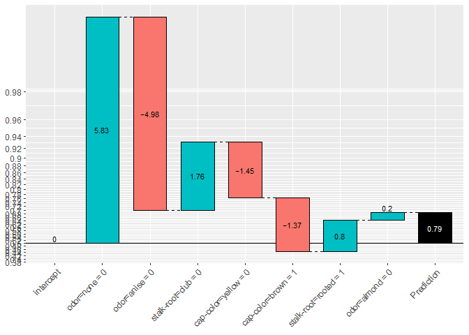

## インストール

本家の記事に従ってgithubからインストール


```r
# install.packages("devtools") 
devtools::install_github(repo = "lantanacamara/lightgbmExplainer")  
```
## lightgbmモデルの学習と予測

いつもの食えるキノコと毒キノコの2値分類。


```r
library(lightgbm) # v2.1.0 or above

# Load Data
data(agaricus.train, package = "lightgbm")
# Train a model
lgb.dtrain <- lgb.Dataset(agaricus.train$data, label = agaricus.train$label)
lgb.params <- list(objective = "binary")
lgb.model <- lgb.train(lgb.params, lgb.dtrain, 5)
```

## 予測の可視化


```r
library(lightgbmExplainer)

# Build Explainer
lgb.trees <- lgb.model.dt.tree(lgb.model) # First get a lgb tree
explainer <- buildExplainer(lgb.trees)
#> 
#> Building the Explainer...
#> STEP 1 of 2
#> 
#> STEP 2 of 2
#> 
#> Getting breakdown for each leaf of each tree...
#> 
  |                                                                       
  |                                                                 |   0%
  |                                                                       
  |=============                                                    |  20%
  |                                                                       
  |==========================                                       |  40%
  |                                                                       
  |=======================================                          |  60%
  |                                                                       
  |====================================================             |  80%
  |                                                                       
  |=================================================================| 100%
#> 
#> DONE!
# compute contribution for each data point
pred.breakdown <- explainPredictions(lgb.model, explainer, agaricus.train$data)
#> 
#> 
#> Extracting the breakdown of each prediction...
#> 
  |                                                                       
  |                                                                 |   0%
  |                                                                       
  |=============                                                    |  20%
  |                                                                       
  |==========================                                       |  40%
  |                                                                       
  |=======================================                          |  60%
  |                                                                       
  |====================================================             |  80%
  |                                                                       
  |=================================================================| 100%
#> 
#> DONE!
# Show waterfall for the 8th observation
showWaterfall(lgb.model, explainer, lgb.dtrain, agaricus.train$data,  8, type = "binary")
#> 
#> 
#> Extracting the breakdown of each prediction...
#> 
  |                                                                       
  |                                                                 |   0%
  |                                                                       
  |=============                                                    |  20%
  |                                                                       
  |==========================                                       |  40%
  |                                                                       
  |=======================================                          |  60%
  |                                                                       
  |====================================================             |  80%
  |                                                                       
  |=================================================================| 100%
#> 
#> DONE!
#> 
#> Actual:  1
#> Prediction:  0.6917514
#> Weight:  0.80832
#> Breakdown
#>         intercept         odor=none        odor=anise   stalk-root=club 
#>         0.0000000         5.8299401        -4.9768851         1.7648213 
#>  cap-color=yellow   cap-color=brown stalk-root=rooted       odor=almond 
#>        -1.4483252        -1.3668200         0.8008371         0.2047518
```

<!-- -->

